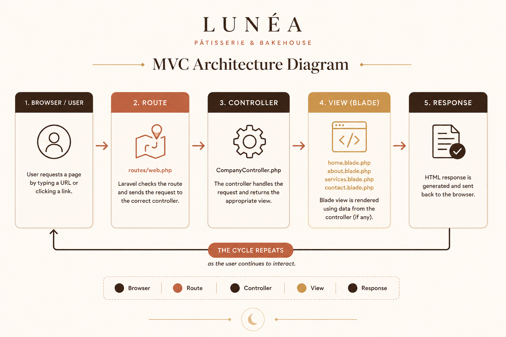
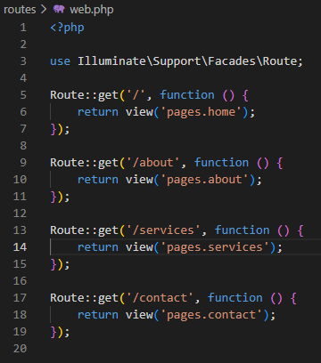
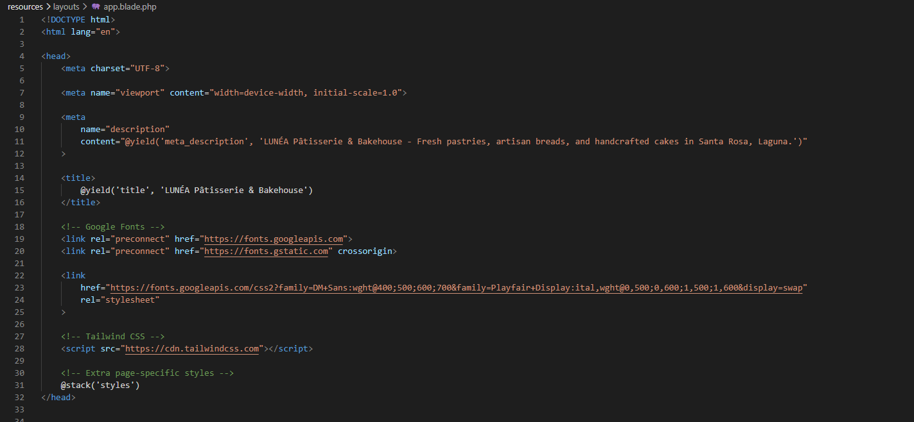
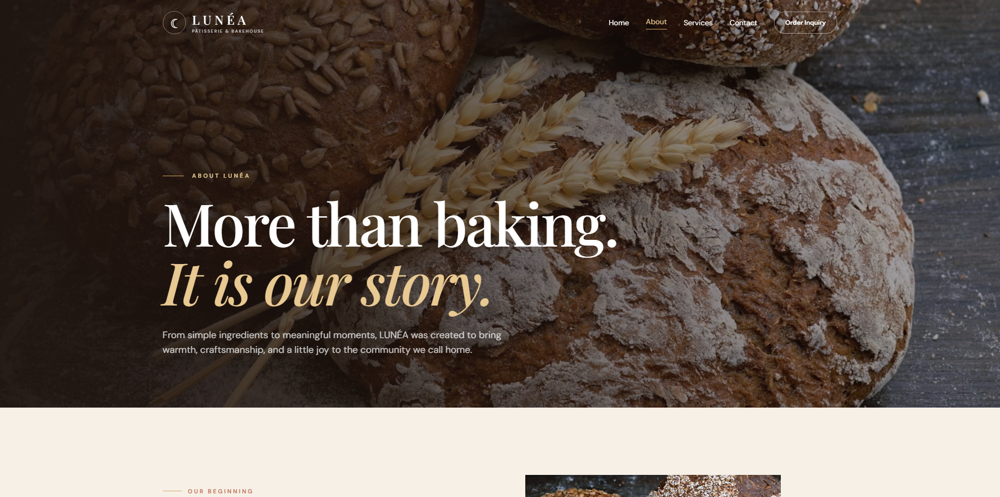
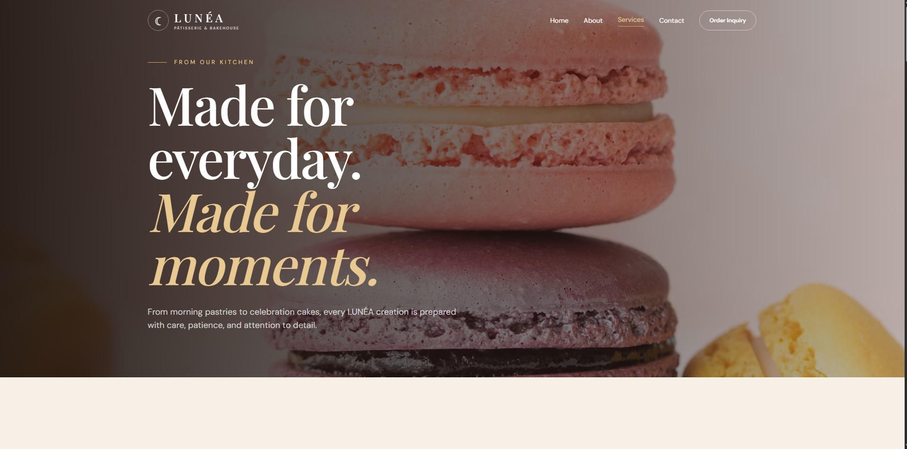
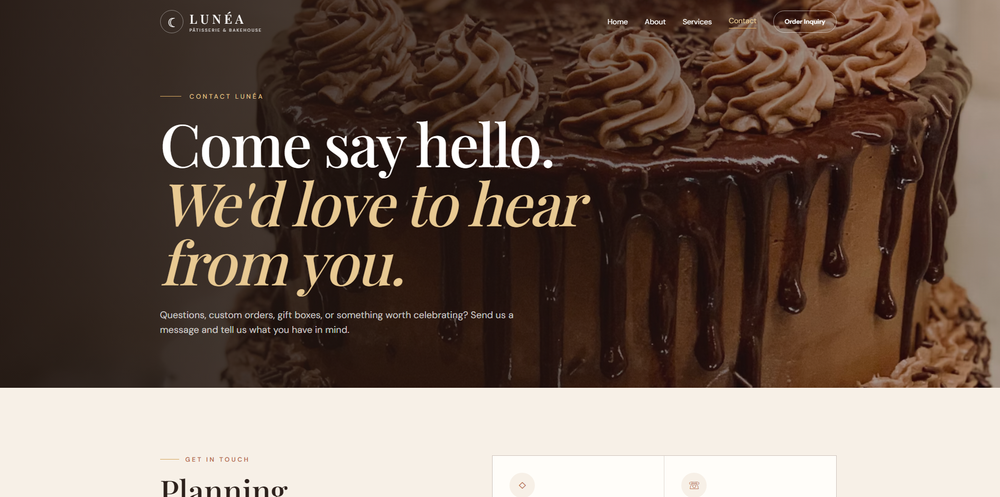
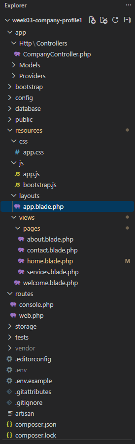
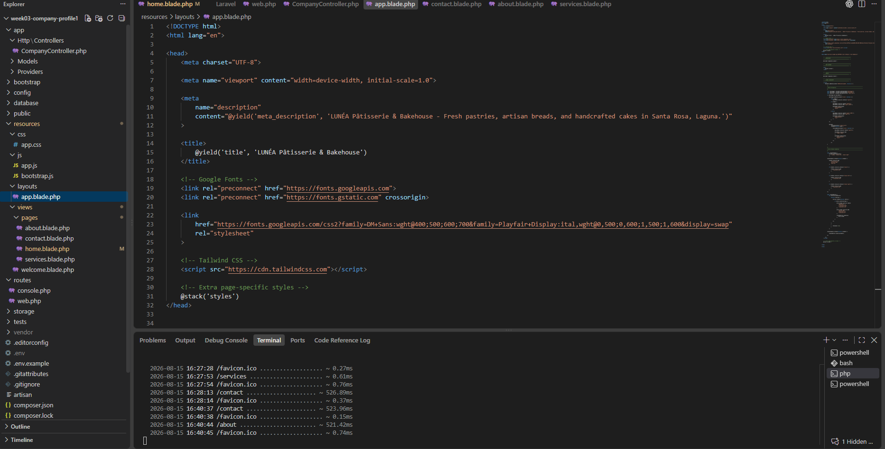
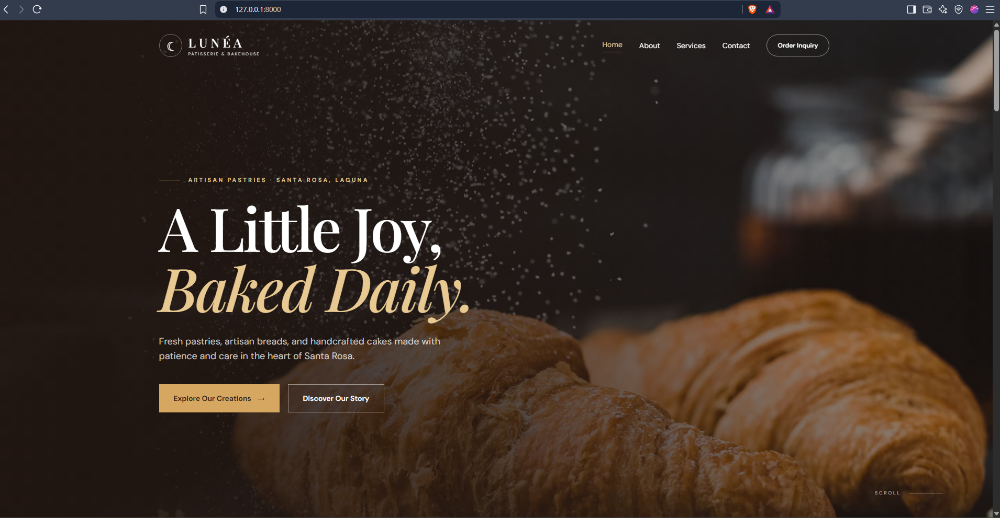

# LUNÉA Pâtisserie & Bakehouse

<p align="center">
  <strong>Company Profile Website using Laravel MVC</strong>
</p>

<p align="center">
  Made Slowly. Enjoyed Fully.
</p>

---

## Project Overview

**LUNÉA Pâtisserie & Bakehouse** is a responsive company profile website developed using Laravel for the Client-Server Technologies activity.

The website represents a local pâtisserie and bakehouse based in Laguna. It presents the company's background, services, mission and vision, contact information, and brand identity through a clean and responsive web interface.

This project was created to practice the basic concepts of **Laravel MVC**, including routing, controllers, Blade views, reusable layouts, and responsive web design.

---

## Project Objectives

The main objectives of this project are to:

- Develop a multi-page company profile website using Laravel.
- Understand how the MVC architecture works in Laravel.
- Configure routes using `routes/web.php`.
- Use a controller to handle page requests.
- Create web pages using Laravel Blade.
- Use a reusable Blade layout for common page elements.
- Apply responsive design using Tailwind CSS.
- Organize files using Laravel's standard project structure.
- Practice Git and GitHub version control.
- Document the project using Markdown.

---

# Company Information

**Company Name:** LUNÉA Pâtisserie & Bakehouse  
**Industry:** Bakery and Pastry  
**Location:** Laguna, Philippines  
**Tagline:** *Made Slowly. Enjoyed Fully.*

LUNÉA Pâtisserie & Bakehouse focuses on handcrafted pastries, artisan breads, celebration cakes, and other baked products.

The brand follows a warm and elegant visual identity using cream, brown, terracotta, and gold tones inspired by pastries, baking, and traditional pâtisserie design.

---

# Website Pages

The website consists of four main pages:

### Home

The Home page introduces the company and gives visitors an overview of LUNÉA, its featured creations, philosophy, and services.

### About

The About page presents the story behind LUNÉA together with the company's mission, vision, values, and other information about the business.

### Services

The Services page presents the different products and services offered by the bakehouse.

### Contact

The Contact page provides visitors with the company's contact information and an interface for sending an inquiry.

---

# Technologies Used

| Technology | Purpose |
|---|---|
| Laravel | Main PHP web framework |
| PHP | Server-side programming |
| Blade | Laravel templating engine |
| Tailwind CSS | Website styling and responsive design |
| HTML | Page structure |
| JavaScript | Animations and interactions |
| Git | Version control |
| GitHub | Repository hosting |
| VS Code | Development environment |

---

# MVC Architecture

## What is MVC?

MVC stands for **Model-View-Controller**. It is a software architecture pattern that separates an application into different responsibilities.

### Model

The Model is responsible for handling application data and business logic.

Since this company profile mainly displays static company information, the current project focuses more on the Controller and View parts of MVC.

### View

The View is responsible for what the user sees in the browser.

In this project, the views are created using Laravel Blade files such as:

```text
home.blade.php
about.blade.php
services.blade.php
contact.blade.php
```

### Controller

The Controller handles requests from the routes and decides which Blade view should be returned to the browser.

The project uses:

```text
app/Http/Controllers/CompanyController.php
```

---

## Why Laravel Uses MVC

Laravel uses MVC to separate the different responsibilities of a web application.

Instead of placing routing, application logic, and HTML inside one file, Laravel organizes them into separate sections. This makes the project easier to understand, maintain, and expand.

---

## Advantages of MVC

- Keeps the project organized.
- Separates application responsibilities.
- Makes code easier to maintain.
- Reduces unnecessary code duplication.
- Makes debugging easier.
- Allows different parts of the application to be updated separately.
- Makes larger applications easier to manage.

---

# MVC Architecture Diagram

The following diagram shows the request flow used in the LUNÉA Laravel website.

<p align="center">
  
</p>

The basic request cycle is:

```text
Browser / User
      ↓
Route
routes/web.php
      ↓
Controller
CompanyController.php
      ↓
Blade View
      ↓
HTML Response
      ↓
Browser / User
```

For example:

```text
User visits /about
        ↓
routes/web.php
        ↓
CompanyController@about
        ↓
pages/about.blade.php
        ↓
HTML Response
        ↓
Browser
```

The same cycle repeats whenever the user requests another page.

---

# Laravel Routing

## What is Routing?

Routing determines how Laravel responds when a user visits a particular URL.

The routes for this project are stored inside:

```text
routes/web.php
```

The website uses routes for the Home, About, Services, and Contact pages.

Example:

```php
Route::get('/about', [CompanyController::class, 'about'])
    ->name('about');
```

When the user visits `/about`, Laravel sends the request to the `about()` method of `CompanyController`.

---

## GET Requests

The project mainly uses GET requests because the website retrieves and displays pages to the user.

Example:

```php
Route::get('/services', [CompanyController::class, 'services'])
    ->name('services');
```

---

## Named Routes

Named routes allow routes to be referenced using readable names.

Example:

```php
Route::get('/contact', [CompanyController::class, 'contact'])
    ->name('contact');
```

This route can then be referenced using:

```blade
{{ route('contact') }}
```

Named routes make navigation easier to manage.

---

## Route Definitions Screenshot

<p align="center">
  
</p>

---

# Controllers

## Purpose of Controllers

Controllers handle requests received from Laravel routes.

Instead of placing all application logic directly inside `web.php`, the routes send requests to methods inside a controller.

This project uses:

```text
app/Http/Controllers/CompanyController.php
```

The controller contains methods for the four main pages:

```php
public function home()
{
    return view('pages.home');
}

public function about()
{
    return view('pages.about');
}

public function services()
{
    return view('pages.services');
}

public function contact()
{
    return view('pages.contact');
}
```

Each method returns the corresponding Blade view.

---

## Benefits of Controllers

Controllers help keep the project organized by separating request handling from route definitions and page presentation.

They also make it easier to add more functionality to the application later.

---

## Controller Screenshot

<p align="center">
  
</p>

---

# Blade Templating

Blade is Laravel's built-in templating engine.

It allows developers to create web pages using HTML together with Laravel-specific directives.

The Blade files for this project are located inside:

```text
resources/views/
```

---

## Blade Layout

The project uses a Blade layout to provide a common structure for different pages.

The main layout is located at:

```text
resources/views/layouts/app.blade.php
```

A page can use the layout with:

```blade
@extends('layouts.app')
```

---

## `@section`

`@section` defines page-specific content.

Example:

```blade
@section('content')

    <h1>Welcome to LUNÉA</h1>

@endsection
```

---

## `@yield`

`@yield` defines where page-specific content should appear inside the main layout.

Example:

```blade
<main>
    @yield('content')
</main>
```

---

## `@include`

`@include` can be used to insert reusable Blade files such as the navigation bar and footer.

Example:

```blade
@include('components.navbar')

@yield('content')

@include('components.footer')
```

This prevents the same code from being unnecessarily repeated on every page.

---

## Blade Layout Screenshot

<p align="center">
  
</p>

---

# Laravel Folder Structure

The project follows Laravel's standard folder structure.

### `app/`

Contains the main application code, including controllers.

### `routes/`

Contains the application's route definitions.

### `resources/`

Contains Blade views and other application resources.

### `public/`

Contains files that can be accessed publicly by the browser.

### `bootstrap/`

Contains files Laravel uses during the framework startup process.

### `config/`

Contains Laravel configuration files.

---

# Project Screenshots

## Home Page

<p align="center">
  
</p>

---

## About Page

<p align="center">
  
</p>

---

## Services Page

<p align="center">
  
</p>

---

## Contact Page

<p align="center">
  
</p>

---

## Navigation Bar

<p align="center">
  
</p>

---

## Footer

<p align="center">
  
</p>

---

# Technical Screenshots

## Laravel Project

<p align="center">
  
</p>

---

## VS Code Project

<p align="center">
  
</p>

---

## Browser Output

<p align="center">
  
</p>

---

# Problems Encountered

## 1. Understanding Laravel Routing

One of the first challenges was understanding how Laravel connects URLs to different pages. Unlike a basic HTML website, Laravel uses routes to determine which controller method should handle each request.

## 2. Organizing Blade Views

It took some time to understand where page views, layouts, and reusable components should be placed inside the Laravel project.

## 3. Maintaining a Consistent Design

Since the website contains multiple pages, I needed to make sure the colors, typography, navigation, footer, spacing, and overall design remained consistent.

## 4. Responsive Design

Some sections looked correct on desktop but needed adjustments for smaller screens. Large headings, images, navigation, and grid layouts had to adapt depending on the screen size.

---

# Solutions

## Routing

I reviewed the routes inside `routes/web.php` and made sure that each URL pointed to the correct method inside `CompanyController`.

## Blade Organization

I separated the individual pages from the main layout and reusable components. This made the project structure easier to understand and maintain.

## Consistent Interface

I followed one visual style throughout the website using the same cream, dark brown, terracotta, and gold color palette.

## Responsive Layout

I used Tailwind CSS responsive utility classes to control layouts, spacing, typography, and other elements depending on the screen size.

---

# Reflection

Developing the LUNÉA Pâtisserie & Bakehouse website helped me understand Laravel better, especially how the MVC architecture organizes a web application. Before working on this project, I was more familiar with creating pages directly using HTML and CSS. Laravel introduced a different way of building websites because each request passes through different parts of the application before the final page appears in the browser.

One of the most useful things I learned was how routing works. I learned that `routes/web.php` is responsible for receiving a request and directing it to the correct controller method. The controller then decides which Blade view should be returned. Understanding this process made the connection between routes, controllers, and views much clearer to me.

I also learned why separating different parts of a project is important. Instead of putting everything in one file, Laravel allows the application to be divided into routes, controllers, views, layouts, and components. At first, this structure was unfamiliar, but as I continued working on the project, it became easier to understand where each file should be placed and what its responsibility was.

Blade templating was another important part of the project. Using a main layout and reusable sections helped me understand how repeated elements such as the navigation bar and footer can be managed more efficiently. This makes the code cleaner because I do not need to rewrite the same structure on every page.

I also improved my understanding of responsive web design while creating the Home, About, Services, and Contact pages. I used Tailwind CSS to control spacing, grids, typography, and layouts for different screen sizes. I learned that responsive design is not only about making elements smaller. The layout itself sometimes needs to change so the website remains easy to use on mobile devices.

Overall, this project gave me a better understanding of how Laravel applications are structured. I learned how routes, controllers, and Blade views work together to process a request and display a page. I can also see how the same MVC structure can be useful when developing larger systems because it keeps different responsibilities separated and makes the project easier to maintain.

---

# Git and GitHub

Git was used to track the development progress of the project.

Meaningful commits were created as different parts of the website were developed.

Example commit history:

```text
feat: create Laravel project
feat: add company routes
feat: create CompanyController
feat: build Home page
feat: build About page
feat: build Services page
feat: build Contact page
feat: add Blade layout
docs: add project screenshots
docs: add MVC architecture diagram
docs: update project README
```

---

# References

- Laravel Documentation
- Tailwind CSS Documentation
- PHP Documentation
- MDN Web Docs

---

## Developer

Developed as a Laravel MVC company profile website for **Client-Server Technologies**.

**Project:** LUNÉA Pâtisserie & Bakehouse  
**Location:** Laguna, Philippines